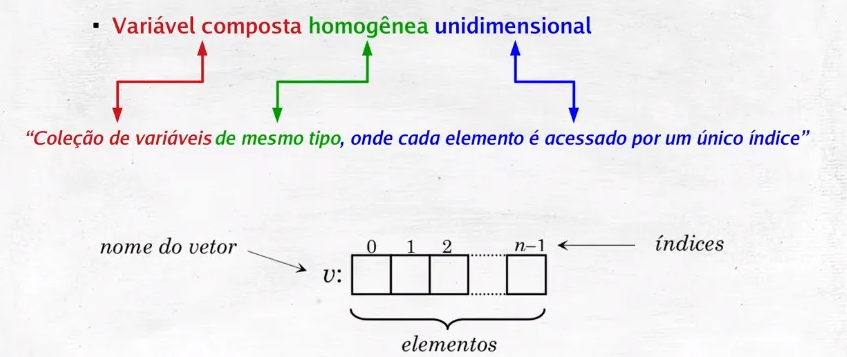
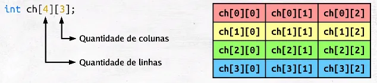
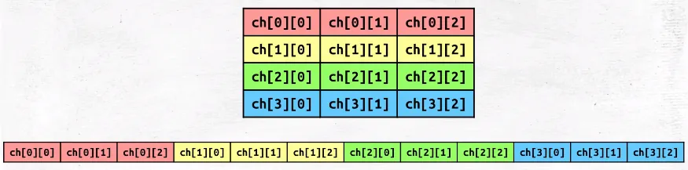
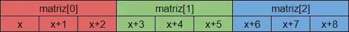

# *Relembrando conceitos de C

## Array

 Ao ser declarado, o compilador reserva uma região na memória para acomodar todos os elementos do vetor, e esses elementos são armazenados consecutivamente

*Sintaxe básica em C*
 ```C
 #include <stdio.h>

int main(void){
    int vet[5]={2,4,6,7,8};

    for(int i=0;i<5;i++){
        printf("%d\t",vet[i]);
    }

    return 0;
} 
 ```

## Matriz


Já discutimos que vetores são áreas consecutivas de memória. A explicação para matrizes é bastante semelhante. É importante compreender que a própria memória é como um grande vetor, assemelhando-se a uma fita com várias casas.



*Sintaxe básica em C*
```C
#include <stdio.h>

int main(void){
    int vet[2][3] = {   {1,4,5},
                        {6,9,7} };

    printf("%d",vet[1][1]); //printa o numero 9

    return 0;
}
```

## Ponteiro
Ponteiro é uma variável que contém um endereço de memória, normalmente, um ponteiro guarda o endereço de uma outra variável ou um pedaço alocado de memória.

Um vetor por si só é um ponteiro que aponta para o primeiro endereço do arranjo, os índíces representam os saltos dados a partir do primeiro índice.

Criar um arranjo de dados por meio de um ponteiro faz com que lidemos memória heap e nos força a deletar o ponteiro no final manualmente ao invés da stack que faz tudo sozinha.

> Por meio deles que conseguiamos utilizar alocação dinâmica para ter vetores dinâmicos.

*Mas não se apeguem muito a eles provavelmente nem vamos usar.*

---

# Arrays e Vectors no contexto de C++

As palavras array e vector podem ser traduzidos como “vetor” em português, mas em C++ têm diferenças técnicas claras.

- Array: diz respeito a uma estrutura com elementos enfileirados, geralmente de tamanho fixo;

- Vector: Também é uma sequência, mas de tamanho variável (em C++)

Dessa forma, existem 3 formas para lidar com esses dados enfileirados, sendo elas no C-style, std::array e std::vector.

## Arrays comuns (C-style)
Igual o C basicamente, portanto, você não tem armas para facilitar leituras de tamanho ou coisas assim de forma direta.

A vantagem é que não precisa incluir nenhuma biblioteca.

```C++
#include <iostream>

using namespace std;

int main(void){
    int vet[3] = {2,4,6};

    for(int i=0;i<3;i++){
        cout << vet[i] << endl;
    }

    return 0;
}
```


## Com std::array

Por conta das limitações dos arrays comuns, o c++ fornece uma alternativa.

Usando o template de array podemos temos mais facilidade para trabalhar com arrays. 

Assim como com as funções de entrada e saída, devemos fazer uso do namespace `std` para criação do vetor e incluir a biblioteca `<array>` no cabeçalho.


```C++
#include <iostream>
#include <array>

int main(void){
    std::array<int,5> b = {3, 5, 6, 7, 9};

    for(int x : b){
        std::cout << x << " ";
    }


    std::cout << std::endl;

    std::cout << "Tamanho: " << b.size();

    std::cout << std::endl;

    return 0;
}
```
 O loop do C++ lembra bastante o `for x in arr:` do Python.

*Em python:*

```Python
arr = [1, 2, 3, 4, 5]
for x in arr:
    print(x, end=' ')
```

*Em C++*
```C++
for (int x : arr) {
    cout << x << " ";
}
```

Essa forma de loop também vai funcionar em `std::vector`, `std::list`, `std::set`, `std::map`. Qualquer coisa que tenha `.begin()` e `.end()` (conceito de iterável em C++)

### Iterável e iterador
Num conceito mais amplo podemos definir que:
- Iterável = O que pode ser percorrido.
    É o "recipiente" (lista, array, string, etc.). Você pode fazer um loop nele;

- Iterador = A "ferramenta" que faz o percurso. É como um ponteiro que vai andando pelos elementos
Sabe onde está e qual é o próximo


 >Em C++ um objeto é considerado iterável se ele tiver:
* Um método ou função chamada .begin()
* Um método ou função chamada .end()
>Esses dois retornam iteradores (tipo ponteiros) que apontam pro início e fim da sequência.


## Com std::vector

Como dito anteriormente, vector dizem respeito a vetores dinâmicos. Você deve adicionar no cabeçalho a biblioteca `<vector>`.

Você só pode adicionar um elemento se alocar espaço na memória para ele. 

Isso pode ser feito enquanto declara o vetor:

```C++
#include <iostream>
#include <vector>

int main(void){
    std::vector <int> a(3);

    std::cin >> a[0] >> a[1] >> a[2];

    for (int x: a){
        std:: cout << x << std::endl;
    }

    return 0;
}
```

Ou em outros momentos usando a função `push_back` que adiciona o elemento no final.

```C++
#include <iostream>
#include <vector>

int main(void){
    std::vector <int> a;

    int x, y, z;

    std::cin >> x >> y >> z;

    a.push_back(x);
    a.push_back(y);
    a.push_back(z);

    for (int i: a){
        std:: cout << i << std::endl;
    }

    return 0;
}
```

### Formas de acessar o vetor

**Índice**
```C++
// Cria um vetor chamado carros que armazenará strings
vector<string> carros = {"Volvo", "BMW", "Ford", "Mazda"};

// Mostra o primeiro elemento
cout << carros[0]; // Exibe Volvo

// Mostra o segundo elemento
cout << carros[1]; // Exibe BMW
```

**Primeiro e último indice**
```C++
// Cria um vetor chamado carros que armazenará strings
vector<string> cars = {"Volvo", "BMW", "Ford", "Mazda"};

// Mostra o primeiro elemento
cout << cars.front();

// Mostra o último elemento
cout << cars.back();
```

**.at()**

- [] não verifica se o índice tá dentro do vetor → rápido, mas perigoso (pode dar erro silencioso).

- .at() verifica os limites → mais seguro, mas um pouco mais lento. Se o índice for inválido, ele lança uma exceção (std::out_of_range).

- Use [] se tiver certeza do que tá fazendo. Use .at() se quiser evitar bugs difíceis de encontrar.

*Provavelmente não vamos usar mas ta ai*

# Matrizes em C++

Assim como os vetores, temos várias formas de lidar com eles em C++, as informações que tratamos antes são validas aqui também.

## Matriz Estática (estilo C) - Tamanho fixo, simples

```C++
int mat[2][3] = {
    {1, 2, 3},
    {4, 5, 6}
};

std::cout << mat[1][2]; // imprime 6
```

- ✅ Simples
- ❌ Não cresce
- ❌ Difícil de passar entre funções (precisa informar tamanhos manualmente)


## Matriz com bib `<array>`

```C++
std::array<std::array<T, cols>, rows>
```

```C++
#include <array>
std::array<std::array<int, 3>, 2> mat = {{
    {{1, 2, 3}}, {{4, 5, 6}}
}};
```
- ✅ Segurança de tipo
- ✅ Usa os recursos da STL
- ❌ Ainda tamanho fixo

## Matriz com bib `<vector>`

```C++
std::vector<std::vector<T>>
```

```C++
int n = 3, m = 4;
std::vector<std::vector<int>> mat(n, std::vector<int>(m));
```
- ✅ Cresce dinamicamente
- ✅ Facílimo de passar pra função
- ❌ Levemente mais lento (tem dois níveis de alocação)

## Matriz com bib `<vector>` de forma linear
Mais eficiente em termos de memória e performance.

```C++
int mat[2][3] = {
    {1, 2, 3},
    {4, 5, 6}
};

std::cout << mat[1][2]; // imprime 6
```

- ✅ Mais rápido
- ✅ Cache friendly
- ❌ Precisa calcular o índice manualmente


---

# Anexos

## Funções array
| Função / Membro       | O que faz                                                                                    |
| --------------------- | -------------------------------------------------------------------------------------------- |
| `at(i)`               | Acessa o elemento na posição `i` com verificação de limite (lança exceção se fora do índice) |
| `operator[]`          | Acessa o elemento na posição `i` sem verificação de limite                                   |
| `front()`             | Retorna o **primeiro** elemento                                                              |
| `back()`              | Retorna o **último** elemento                                                                |
| `data()`              | Retorna um ponteiro para o array subjacente (tipo `T*`)                                      |
| `begin()` / `end()`   | Iteradores para início/fim                                                                   |
| `rbegin()` / `rend()` | Iteradores reversos (de trás pra frente)                                                     |
| `size()`              | Retorna o número de elementos (sempre o valor `N`)                                           |
| `empty()`             | Retorna `true` se o array estiver vazio (`N == 0`)                                           |
| `fill(value)`         | Preenche todos os elementos com o valor passado                                              |
| `swap(other)`         | Troca o conteúdo com outro array                                                             |

## Funções vector

### 🎯 Acesso e informações

| Função / Membro | O que faz                                                 |
| --------------- | --------------------------------------------------------- |
| `at(i)`         | Acessa o índice com verificação de limite (lança exceção) |
| `operator[]`    | Acessa o índice sem verificação                           |
| `front()`       | Retorna o primeiro elemento                               |
| `back()`        | Retorna o último elemento                                 |
| `data()`        | Retorna ponteiro pro array interno                        |
| `size()`        | Número de elementos                                       |
| `capacity()`    | Tamanho do espaço alocado (pode ser maior que `size()`)   |
| `empty()`       | Retorna `true` se estiver vazio                           |

---

### ➕ Inserção

| Função              | O que faz                                               |
| ------------------- | ------------------------------------------------------- |
| `push_back(val)`    | Adiciona elemento no final                              |
| `insert(pos, val)`  | Insere antes da posição dada (`pos` = iterador)         |
| `emplace_back(...)` | Cria o elemento no final (sem cópia)                    |
| `emplace(pos, ...)` | Cria o elemento direto na posição                       |
| `resize(n)`         | Altera o tamanho (pode preencher com zeros ou destruir) |
| `assign(n, val)`    | Preenche com `n` cópias de `val`                        |

---

### ➖ Remoção

| Função              | O que faz                                           |
| ------------------- | --------------------------------------------------- |
| `pop_back()`        | Remove o último elemento                            |
| `erase(pos)`        | Remove o elemento em `pos`                          |
| `erase(start, end)` | Remove intervalo                                    |
| `clear()`           | Remove todos os elementos                           |
| `shrink_to_fit()`   | Reduz `capacity` para `size` (libera memória extra) |

---

### 🔀 Outros

| Função                | O que faz                                    |
| --------------------- | -------------------------------------------- |
| `swap(other)`         | Troca os dados com outro `vector`            |
| `reserve(n)`          | Garante que a capacidade será pelo menos `n` |
| `begin()` / `end()`   | Iteradores padrão                            |
| `rbegin()` / `rend()` | Iteradores reversos                          |

---

### Exemplo prático de uso

```cpp
#include <iostream>
#include <vector>

int main() {
    std::vector<int> vec = {1, 2, 3};

    vec.push_back(4);            // [1, 2, 3, 4]
    vec.insert(vec.begin() + 1, 10); // [1, 10, 2, 3, 4]

    std::cout << vec.front();    // 1
    std::cout << vec.back();     // 4

    vec.pop_back();              // [1, 10, 2, 3]
    vec.erase(vec.begin() + 2);  // Remove o 2 → [1, 10, 3]

    vec.resize(5);               // [1, 10, 3, 0, 0]
    vec.shrink_to_fit();         // Tenta liberar memória extra

    for (int x : vec)
        std::cout << x << " ";   // Imprime tudo
}
```
